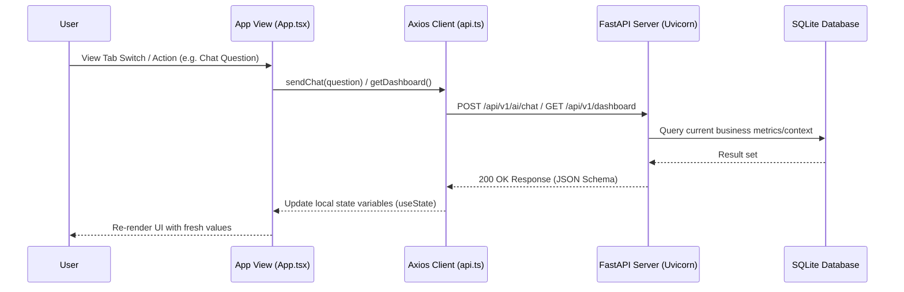

# Stratify (SME OS): Architectural & Operational Specification

Stratify (SME OS) is an enterprise-grade, local-AI-driven Business Operating System built to automate decision-making, transactional ledger flows (CRUD), document ingestion parsing, and predictive runway analytics for Small & Medium Enterprises.

---

## 1. System Topology & Workspace Structure

The project workspace is divided into a decoupled **FastAPI ASGI Backend** and a **Vite React Single Page Application (SPA) Frontend**:

```text
stratify/
├── README.md                   # Complete architectural & operational specification
├── design.md                   # Locked design system (tokens, CSS variables)
├── package-lock.json           # Root lock file
├── skills-lock.json            # Lock file for agent skills
├── docs/                       # Project documentation
│   └── decisions/              # Architectural Decision Records (ADRs)
│       └── 0001-multi-agent-decision-engine.md
├── backend/                    # FastAPI ASGI Python application
│   ├── app/                    # Main source code package
│   │   ├── main.py             # App entrypoint, lifespan lifecycle, middleware, prefix registry
│   │   ├── config.py           # Environment variables configuration management (Pydantic settings)
│   │   ├── database.py         # SQLAlchemy connection engine & DB session dependencies
│   │   ├── models/             # Database ORM entity mapping classes
│   │   │   ├── business.py     # Entities: Company, Customer, Supplier, Product, Invoice, Sales, Inventory
│   │   │   └── history.py      # Audits: BusinessEvent, RecommendationHistory, DecisionHistory
│   │   ├── schemas/            # Pydantic v2 validation data transfer objects DTOs
│   │   │   ├── business.py     # Base, Create, Update, and Schema properties for business entities
│   │   │   ├── predictive.py   # Forecast return formats (Prediction, Confidence, Feature weights)
│   │   │   └── decision.py     # Simulation input/outputs & recommendation summaries
│   │   ├── routers/            # Versioned API routes mapping controller actions
│   │   │   ├── business.py     # CRUD controllers for customers, suppliers, products, invoices, sales
│   │   │   ├── dashboard.py    # Analytics dashboards, alerts, business health scores, timeline events
│   │   │   ├── ai.py           # Local LLM chat (Ollama status) and executive briefs
│   │   │   ├── forecast.py     # Time-series regression forecasting models
│   │   │   ├── risk.py         # Volatility, late-payment, and delivery delay risk estimators
│   │   │   ├── decision.py     # Multi-Agent consensus, explanation audit, digital twin simulation
│   │   │   └── upload.py       # Async document ingestors
│   │   ├── services/           # Business domain processing engines
│   │   │   ├── agent_engine.py # CEO orchestration of 6 domain expert agents
│   │   │   ├── business_memory.py # Episodic contextual database retriever
│   │   │   ├── doc_intelligence.py # Parser triggers mapping PDF/XLSX text to JSON DTOs
│   │   │   ├── ollama_client.py # Local Ollama LLM integration client
│   │   │   ├── prediction_engine.py # Regression analytics models (Revenue, Cash flow, Demand)
│   │   │   └── simulation_engine.py # Volatility Twin what-if math multipliers
│   │   └── utils/              # Utility helpers
│   │       ├── helpers.py      # Common helper functions
│   │       └── prompt_builder.py # Context-aware prompt template builder
│   ├── requirements.txt        # Backend dependencies
│   ├── sme_platform.db         # SQLite transactional database
│   └── docker-compose.yml      # Multi-service local launch (FastAPI, Ollama)
└── frontend/                   # React 19 + Vite + TypeScript Single Page App
    ├── src/                    # App source code
    │   ├── main.tsx            # Main App entrypoint
    │   ├── App.tsx             # Interactive dashboard, view states, telemetry charts, Chat panels
    │   ├── api.ts              # Axios api client integration
    │   ├── index.css           # Global custom typography, glassmorphism, scrollbars
    │   └── App.css             # Specific layout styling
    ├── public/                 # Static assets directory
    ├── index.html              # Shell HTML template
    ├── package.json            # Frontend script actions & dependency list
    ├── tsconfig.json           # TypeScript configuration
    └── vite.config.ts          # Vite build tool configuration
```

---

## 2. Decoupled Architecture Specifications

### A. Backend Architecture & API Routes

The backend uses **FastAPI** with async router endpoints. Database transactions are isolated per request using SQLAlchemy async sessions.

#### 1. Versioning Protocol
All api controllers are registered under the version prefix `/api/v1` in `app/main.py`:
- Prefix variable: `API_V1 = "/api/v1"`
- CORS settings are configured to allow access from local frontend clients (`http://localhost:5173` or specified origins).

#### 2. Complete Router Mappings
- **Business CRUD Router (`/business`)**:
  - `GET /business/company` & `POST /business/company` — Retrieve/setup company master details.
  - `GET /business/customers` & `POST /business/customers` — Manage customer directories.
  - `GET /business/suppliers` & `POST /business/suppliers` — Manage suppliers metadata.
  - `GET /business/products` & `POST /business/products` — Manage product catalogue items.
  - `GET /business/inventory` — Monitor warehouse stock levels.
  - `GET /business/invoices` & `POST /business/invoices` — Log ledger AR/AP invoices.
  - `GET /business/sales` & `POST /business/sales` — Log sales transactions (decrements inventory, increments customer CLV).
- **Dashboard & Analytics Router (no prefix)**:
  - `GET /dashboard` — High-level KPIs calculated from live transaction data (Revenue, Net Working Capital, AR, AP, Active Customers).
  - `GET /business-health` — Composite business health score derived from profitability, liquidity, and risk indicators.
  - `GET /alerts` — Active operational alerts.
  - `GET /timeline` — Chronological business event audit feed.
- **AI Intelligence Router (`/ai`)**:
  - `POST /ai/chat` — Context-aware chat matching prompt contexts dynamically built from recent business events and records.
  - `GET /ai/ollama-status` — Reports whether the local Ollama daemon is reachable and the configured model is available.
  - `GET /ai/executive-brief` — Structured morning briefs compiled from database states (returns morning summary text, alerts, opportunities, actions).
- **Forecasting Router (`/forecast`)**:
  - `GET /forecast/revenue` — 90-day revenue forecast using weighted historical sales velocity.
  - `GET /forecast/cashflow` — 30-day cash flow forecast based on outstanding AR/AP balances.
  - `GET /forecast/demand` — Per-product demand forecasting and reorder quantities.
- **Risk & Pricing Router (no prefix)**:
  - `GET /risk/customers` — Customer churn risk, late payment probability, and CLV forecasts.
  - `GET /risk/suppliers` — Delay probability and procurement price increase risk.
  - `GET /pricing` — Margin-optimised pricing advice per product.
- **Decision Engine Router (no prefix)**:
  - `GET /agents` — Executes 6 specialists (Finance, Logistics, Marketing, Supplier, Customer, Risk) and compiles individual reports.
  - `GET /recommendations` — Synthesizes domain reports into CEO strategic consensus suggestions.
  - `POST /simulate` — Digital twin simulation calculating simulated revenue, profit, cash, and risk indices from what-if sliders.
  - `GET /decision-history` & `POST /decision-history` — Log user responses (Approve/Decline) to recommendation cards.
  - `GET /explain/{recommendation_id}` — Resolves evidentiary details and affected departments for recommendations.
- **Upload Router (`/upload`)**:
  - `POST /upload/invoice`, `POST /upload/gst`, `POST /upload/bank`, `POST /upload/excel` — Multi-part form endpoints queuing background document parsing tasks.

---

### B. Frontend Architecture & Design Elements

The user interface implements a premium, dark developer dashboard style using React 19 and Vite.

#### 1. Design System & CSS Rules (`src/index.css`)
- **Background Layer**: OKLCH deep midnight blue `oklch(14% 0.012 250)` combined with crisp cool white `oklch(95% 0.008 250)` text.
- **Glass Panel Blur**: `.glass-panel` and `.card` wrappers styled with `rgba(17, 17, 17, 0.7)` background, `backdrop-filter: blur(12px)` and subtle `border: 1px solid rgba(255, 255, 255, 0.08)`.
- **Developer Scrollbar**: Tailored scrollbars using `-webkit-scrollbar` with translucent thumbs (`rgba(255, 255, 255, 0.1)`) that expand on hover.
- **Microinteractions**: Active states show explicit `outline: 2px solid var(--color-focus); outline-offset: 2px;` borders. Subtle hover translations on cards and navigation buttons.

#### 2. Interactive SVG Analytics & Sparklines
- **Sparkline SVG**: Light inline SVG vectors charting historical trends next to metrics (e.g. Total Revenue, Net Working Capital, Active Customers).
- **Telemetry Charts**: Interactive SVG graphs with confidence bounds (upper confidence and lower risk margins) and dynamic crosshairs displaying data tooltips on hover.
- **Number Tickers**: Custom React `NumberTicker` component which smoothly counts up to target values using easing functions, conforming to accessibility standards with support for `prefers-reduced-motion`.

---

## 3. Real-Time Data Flow & State Synchronization

The frontend coordinates user action events and triggers state fetches to keep dashboards aligned with backend SQLite telemetry:



### A. Navigation View States
The interface maintains state for the active view (`page` state):
- `dashboard`: Telemetry bento grid containing core KPIs, alerts, and recent business timeline events.
- `forecast`: Interactive trendlines showing projected revenue, cash flow runway, and demand.
- `risk`: Customer and supplier risk tables mapping late payment and delivery delay factors.
- `agents`: Consensus engine running individual specialist analyses.
- `simulate`: What-if simulation dashboard with sliders projecting corporate health index impact.
- `chat`: Multi-agent conversation panel interacting with the local Gemma model.
- `brief`: Unified structured morning brief checklist.
- `history`: Decisions logs showcasing past recommendation cards and approval audits.
- `upload`: File dropzone for uploading invoices, bank statements, and spreadsheets.

---

## 4. Operational Instructions & Stack Launch

### A. Backend Setup
1. Change directory: `cd backend`
2. Create the isolated virtual environment if it does not already exist: `python -m venv venv`
3. Activate it before running any backend commands:
   - PowerShell: `.\venv\Scripts\Activate.ps1`
   - Command Prompt: `.\venv\Scripts\activate.bat`
   - Git Bash / WSL shell on Windows: `source venv/bin/activate`
4. Upgrade packaging tools and install backend dependencies inside the venv: `python -m pip install --upgrade pip && python -m pip install -r requirements.txt`
5. Run the API server from the activated venv: `python -m uvicorn app.main:app --reload --port 8000`

Backend environment variables live in `backend/.env`. The application reads settings like `DATABASE_URL`, `OLLAMA_BASE_URL`, `OLLAMA_MODEL` (default is `gemma4:latest` or similar), with safe defaults for local development.

Before starting the backend, make sure Ollama is running locally and the configured model is installed (e.g., `ollama run gemma4:latest`).

If you prefer a fully containerised local stack, start the backend from `backend/docker-compose.yml`; it includes an Ollama service and maps dependencies automatically.

### B. Frontend Setup
1. Change directory: `cd frontend`
2. Install packages: `npm install`
3. Launch development client: `npm run dev`

---

## 5. Automated Verification Skill

A workspace verifier agent skill is located in [SKILL.md](file:///d:/IT/stratify/.agents/skills/sme_os_verifier/SKILL.md) inside the `.agents` customizations folder.

To perform a stack verify command:
```bash
./.agents/skills/sme_os_verifier/scripts/verify_stack.sh
```
This script audits:
- If the SQLite file `backend/sme_platform.db` exists.
- If the FastAPI server is online on port 8000 and responds to `/health`.
- If the frontend client is online on port 5173.
