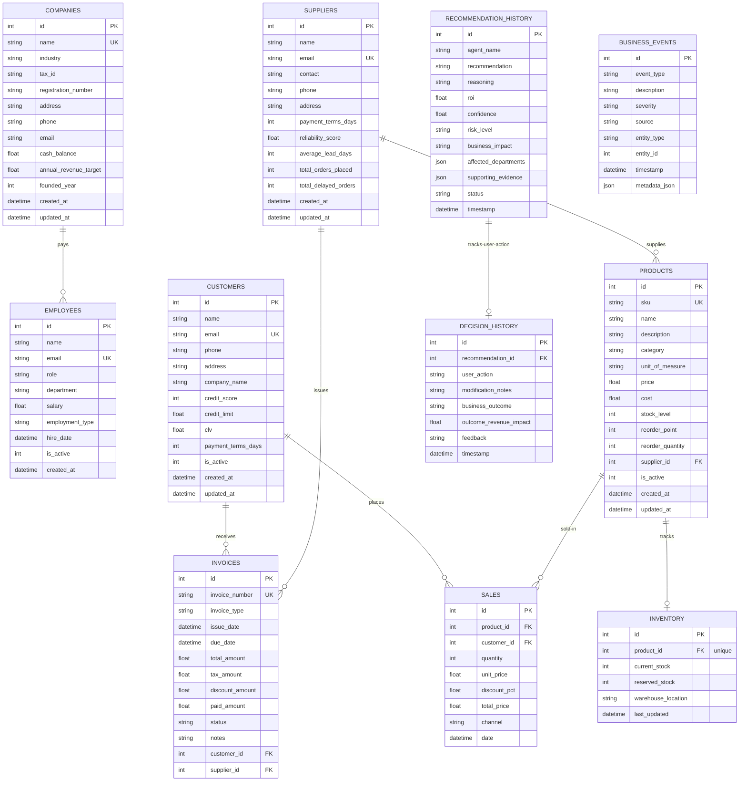

# Gemma SME OS: Database & Dataset Specification

This document details the database schema (SQLite), relational schema maps, custom JSON episodic memory structures, and file upload specifications used in the Gemma SME OS.

---

## 1. Relational Database Schema Specification

The transactional database is stored in `backend/sme_platform.db` (SQLite) and managed via SQLAlchemy ORM. The relational structure consists of **11 primary tables**:



---

## 2. Table-by-Table Data Dictionary

### A. Core Operating Tables

#### 1. `companies`
Represents the single main business profile record.
*   `id`: Integer, Primary Key.
*   `name`: String(255), Not Null, Unique.
*   `industry`: String(100), Nullable.
*   `tax_id` / `registration_number`: String(50), Nullable.
*   `cash_balance`: Float, default `0.0` (Monitored cash reserves).
*   `annual_revenue_target`: Float, default `0.0`.
*   `founded_year`: Integer, Nullable.

#### 2. `customers`
Stores client demographics, credit worthiness, and financial metrics.
*   `id`: Integer, Primary Key.
*   `email`: String(255), Unique, Indexed, Not Null.
*   `credit_score`: Integer, default `700` (Bounded 300–850). Used for risk/churn models.
*   `credit_limit`: Float, default `10000.0`.
*   `clv`: Float, default `0.0` (Accumulated customer lifetime value).
*   `payment_terms_days`: Integer, default `30`.
*   `is_active`: Integer, default `1` (1 = active, 0 = churned).

#### 3. `suppliers`
Tracks vendors, average delivery lead times, and reliability metrics.
*   `id`: Integer, Primary Key.
*   `email`: String(255), Unique, Not Null.
*   `payment_terms_days`: Integer, default `30`.
*   `reliability_score`: Float, default `1.0` (0.0 = worst, 1.0 = perfect delivery rate).
*   `average_lead_days`: Integer, default `7`.
*   `total_orders_placed` / `total_delayed_orders`: Integer, defaults `0`. Used for dynamic reliability calculation:
    $$\text{Reliability} = 1.0 - \frac{\text{Delayed Orders}}{\text{Total Orders}}$$

#### 4. `products`
The master inventory SKU log.
*   `id`: Integer, Primary Key.
*   `sku`: String(50), Unique, Indexed, Not Null.
*   `price`: Float, Not Null (Standard customer selling price).
*   `cost`: Float, Not Null (Direct acquisition cost from vendor).
*   `stock_level`: Integer, default `0`.
*   `reorder_point`: Integer, default `10`.
*   `reorder_quantity`: Integer, default `50`.
*   `supplier_id`: Integer, Foreign Key to `suppliers.id`.

#### 5. `invoices`
Contains both Accounts Receivable (AR) and Accounts Payable (AP) ledgers.
*   `id`: Integer, Primary Key.
*   `invoice_number`: String(100), Unique, Indexed, Not Null.
*   `invoice_type`: String(10), default `AR` (Value is either `AR` or `AP`).
*   `issue_date` / `due_date`: DateTime, Not Null.
*   `total_amount` / `tax_amount` / `discount_amount` / `paid_amount`: Float.
*   `status`: String(20), default `UNPAID` (Values: `UNPAID`, `PARTIAL`, `PAID`, `OVERDUE`).
*   `customer_id`: Integer, Foreign Key to `customers.id` (set only if type is `AR`).
*   `supplier_id`: Integer, Foreign Key to `suppliers.id` (set only if type is `AP`).

#### 6. `sales`
Logs individual retail / wholesale sales transactions.
*   `id`: Integer, Primary Key.
*   `product_id`: Integer, Foreign Key to `products.id`.
*   `customer_id`: Integer, Foreign Key to `customers.id`.
*   `quantity`: Integer, Not Null.
*   `unit_price` / `total_price`: Float, Not Null.
*   `discount_pct`: Float, default `0.0`.
*   `channel`: String(50), default `direct` (`direct`, `online`, `partner`).

#### 7. `inventory`
Provides warehouse coordinates and reservations.
*   `id`: Integer, Primary Key.
*   `product_id`: Integer, Foreign Key to `products.id`, Unique (One-to-one relationship).
*   `current_stock` / `reserved_stock`: Integer, default `0`.
*   `warehouse_location`: String(100), Nullable.

#### 8. `employees`
Headcount operational ledger.
*   `id`: Integer, Primary Key.
*   `salary`: Float, Not Null.
*   `employment_type`: String(20), default `full_time` (`full_time`, `part_time`, `contractor`).

---

### B. Audit & Memory Tables

#### 9. `business_events`
Stores timestamped episodic data logs consumed by the local LLM chat context.
*   `id`: Integer, Primary Key.
*   `event_type`: String(50), Not Null (`TRANSACTION`, `COMPLAINT`, `SUPPLIER_DELAY`, `PRICE_CHANGE`, `INVENTORY_ALERT`, `DOC_INGESTED_*`).
*   `description`: String(2000), Not Null (Natural language summary).
*   `severity`: String(20), default `INFO` (`INFO`, `WARNING`, `CRITICAL`).
*   `metadata_json`: JSON, Nullable (Structured payload specific to event type).

#### 10. `recommendation_history`
Maintains records of all recommendations generated by the orchestrator.
*   `id`: Integer, Primary Key.
*   `agent_name`: String(100), Not Null (e.g. `FinanceAgent`, `CEOAgent`).
*   `recommendation`: String(5000), Not Null.
*   `roi`: Float, default `0.0`.
*   `confidence`: Float, default `0.8` (0.0 to 1.0).
*   `risk_level`: String(20), default `MEDIUM` (`LOW`, `MEDIUM`, `HIGH`, `CRITICAL`).
*   `affected_departments`: JSON, Nullable (e.g. `["Finance", "Operations"]`).
*   `supporting_evidence`: JSON, Nullable (List of raw statistics that triggered the item).
*   `status`: String(20), default `PENDING` (`PENDING`, `APPROVED`, `REJECTED`, `MODIFIED`).

#### 11. `decision_history`
Tracks user action responses to recommendations to capture reinforcement feedback.
*   `id`: Integer, Primary Key.
*   `recommendation_id`: Integer, Nullable.
*   `user_action`: String(20), Not Null (`APPROVED`, `REJECTED`, `MODIFIED`).
*   `business_outcome`: String(2000), Nullable (Observed operational impact).
*   `outcome_revenue_impact`: Float, Nullable (Direct dollar changes).

---

## 3. Episodic Memory Payload Specifications (`metadata_json`)

The `business_events.metadata_json` column stores specific schemas depending on the event type:

### A. TRANSACTION Event Payload
Logged when invoice payments or product sales occur.
```json
{
  "invoice_number": "INV-2026-004",
  "amount": 4500.00,
  "payment_method": "ACH_TRANSFER",
  "terms_met": true,
  "outstanding_balance": 0.00
}
```

### B. INVENTORY_ALERT Event Payload
Logged when stock falls below reorder points.
```json
{
  "sku": "SKU-MON-24",
  "current_stock": 2,
  "reorder_point": 10,
  "projected_runway_days": 4
}
```

### C. DOCUMENT_INGESTED Event Payload
Logged when a PDF or Excel document is uploaded and parsed.
```json
{
  "file_name": "q3_gst_filing.pdf",
  "file_type": "GST_RETURN",
  "parsed_fields": {
    "total_input_tax_credit": 1240.50,
    "gross_taxable_turnover": 45000.00,
    "tax_payable": 8100.00
  }
}
```

---

## 4. Ingestible Document Formats (`sample_docs/`)

The platform contains raw sample logs inside `sample_docs/` that the ingestion service (`doc_intelligence.py`) parses:

*   **`sample_docs/invoices/`**: Contains PDF/Excel invoices mapping to `Invoice` database schemas. Must contain:
    *   Header strings: `Invoice Number`, `Due Date`, `Subtotal`, `Tax`.
    *   Vendor details or Client details depending on AP vs AR.
*   **`sample_docs/gst/`**: Structured spreadsheets containing business tax declarations, mapping input credit values to the overall expense matrix.
*   **`sample_docs/bank/`**: Bank transaction logs (CSV/XLSX) containing columns `Date`, `Description`, `Debit`, `Credit`, `Balance`. Used to reconstruct and audit cash accounts in the `companies` table.
