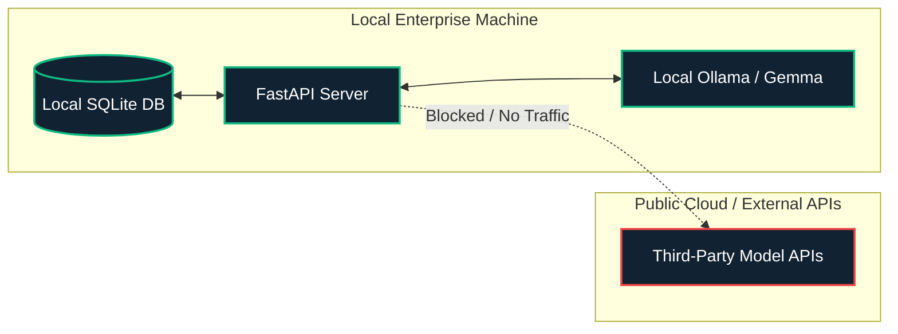
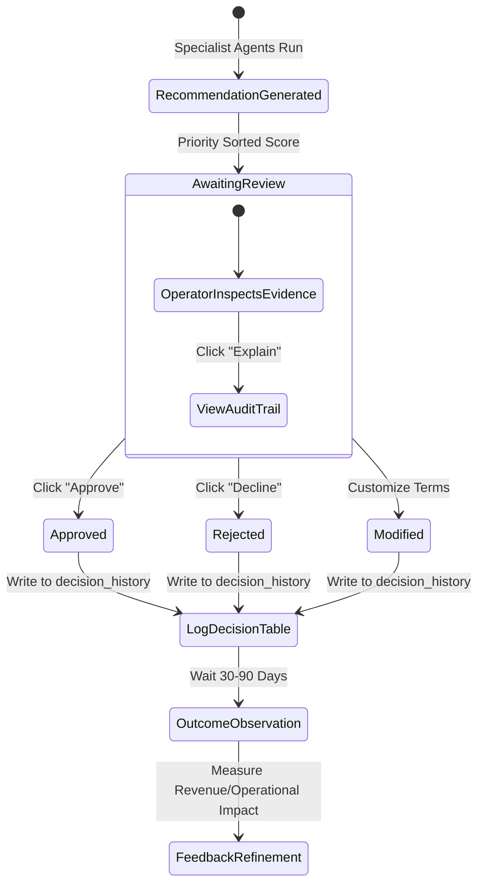

# Gemma SME OS: Ethical & Operational Considerations

This document details the ethical parameters, algorithmic bias mitigation strategies, data privacy architectures, and Human-in-the-Loop (HITL) validation frameworks governing the Gemma SME OS.

---

## 1. Data Privacy & Local Deployment Rationale

Small and Medium Enterprises (SMEs) process highly sensitive transaction ledgers, customer credit reports, supplier agreements, tax filings, and payroll databases. Conventional cloud-based AI systems require transmitting this corporate intelligence to third-party APIs (e.g. OpenAI, Anthropic, or proprietary cloud models).

### A. Zero-Cloud Leak Architecture
To address data privacy concerns, the Gemma SME OS is designed around a **Zero-Cloud Leak Architecture**:
*   **Local Inference**: The system integrates with a local **Ollama** server running the **Gemma** open-weights LLM. All text generation and summarization occur on local physical or containerized CPU/GPU resources.
*   **Local Database**: Transaction records are persisted inside an embedded, encrypted, or locally hosted SQLite file (`sme_platform.db`), preventing remote access and external exposure.
*   **Compliance Framework**: Local execution ensures adherence to strict data residency laws, GDPR (General Data Protection Regulation), and local financial secrecy laws, allowing SMEs to deploy AI capabilities without exposing customer data to external APIs.



---

## 2. Explainable AI (XAI) & Recommendation Transparency

Automated recommendation systems can generate "hallucinations" or draw incorrect conclusions if models operate as black boxes. In financial systems, unexplained recommendations can lead to poor decision-making and legal liability.

### Evidentiary Log Specifications
To enforce accountability, every recommendation emitted by the `CEOAgent` and its specialist agents is accompanied by an **Evidentiary Log**:
1.  **Traceability**: The API returns a `supporting_evidence` JSON array mapping the recommendation back to the exact database threshold that triggered it.
    *   *Example*: A recommendation to raise pricing is accompanied by:
        ```json
        {
          "trigger": "Gross Profit Margin (GPM) < 25%",
          "actual_gpm": "23.4%",
          "formula": "Gross Profit / Revenue"
        }
        ```
2.  **No Unverified Recommendations**: Agents cannot issue recommendations without verifying the underlying metrics in the database context. This constraint prevents the local LLM from generating arbitrary advice during chat sessions.

---

## 3. Algorithmic Biases & Mitigating Feedback Loops

Algorithmic feedback loops occur when automated system actions reinforce the predictive assumptions of the model.

### A. The Credit Capping Loop (Self-Fulfilling Prophecy)
*   **The Risk**: The `CustomerAgent` evaluates credit scores and late payment risks. If a customer is flagged as `HIGH` late payment risk, the system recommends restricting their credit limits and requiring upfront cash payments.
*   **The Loop**: Restricting credit may strain the customer's cash flow, making it harder for them to pay outstanding bills, which lowers their credit score further and confirms the agent's initial risk prediction. This can lead to customer churn.
*   **Mitigation**: The system does not automate credit limit adjustments. Instead, it presents recommendations as suggestions for human review, incorporating a "qualitative variance" parameter to override model projections when appropriate.

### B. Supplier Rating Bias
*   **The Risk**: The `SupplierAgent` rates vendors based on a reliability score derived from delays. A supplier suffering from temporary, systemic global supply chain disruptions (e.g. shipping lane blockages) will receive low ratings.
*   **The Loop**: The system recommends switching to other vendors. Swapping vendors reduces orders to the initial supplier, ending the relationship and preventing their reliability score from recovering.
*   **Mitigation**: Supplier ratings include a rolling weighted window that discounts outliers, allowing procurement managers to manually adjust risk models during global disruptions.

---

## 4. Human-in-the-Loop (HITL) Validation & Refinement

The Gemma SME OS employs a Human-in-the-Loop architecture where the AI agent advises but the human decides.



### A. The Decision History Loop
Every user action is recorded in the `decision_history` table:
*   `user_action`: Logs whether the recommendation was `APPROVED`, `REJECTED`, or `MODIFIED`.
*   `modification_notes`: Captures the operator's changes to the agent's logic.
*   `feedback`: Stores the user's comments.

### B. Long-Term Optimization
This dataset serves as a supervised learning set. Future model iterations or local fine-tuning steps can analyze the correlation between approved recommendations and measured outcomes (`outcome_revenue_impact`), optimizing agent decision thresholds to align with the enterprise's risk appetite.
