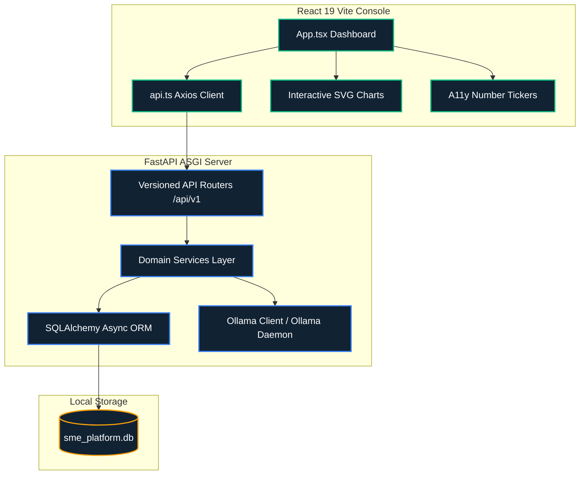
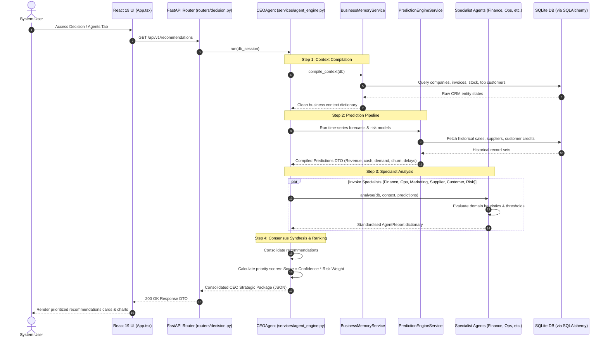

# Gemma SME OS: Technical Architecture Specification

This document provides a deep, comprehensive overview of the system topology, component interaction models, service layers, and state synchronisation patterns implemented in the Gemma SME OS.

---

## 1. System Topology Overview

The system is designed with a decoupled, client-server topology. It features an asynchronous **FastAPI ASGI Backend** representing the application server and a **React 19 Vite Single Page Application (SPA)** representing the dashboard console. Data persistence is handled via an embedded **SQLite Database**, and local intelligence is facilitated through a local **Ollama** server running the Gemma LLM model.

---

## 2. Dynamic Component Interaction & Data Flows

The core runtime intelligence of Gemma SME OS centers on the execution of the multi-agent decision cycle managed by the `CEOAgent`. Below is the complete operational data flow sequence when a user switches to the **Decision / Agents Console** or triggers a recommendation synthesis.

---

## 3. Service Layer Deep Dive

### A. The Multi-Agent Decision Engine (`agent_engine.py`)

The platform implements a **Specialist-Orchestrator Pattern** to model specialized domain logic deterministically before synthesizing it. 

#### 1. Specialist Agents Specifications
Each specialist inherits from `BaseAgent` and implements an async `analyse()` method that processes raw business context and prediction matrices, returning a structured `AgentReport` dictionary.

*   **`FinanceAgent`**: Computes Gross Profit Margin (GPM), Accounts Receivable (AR), and Accounts Payable (AP).
    *   *Thresholds*:
        *   $\text{GPM} < 25\%$: Flag critical margin warnings.
        *   $\text{GPM} < 35\%$: Suggest cost optimization or price increases.
        *   $\text{AP} > \text{AR}$: Alert on negative net working capital and suggest deferring non-critical bills.
*   **`OperationsAgent`**: Evaluates inventory stock levels and supply chain bottlenecks.
    *   *Thresholds*:
        *   $\text{Out-of-Stock SKUs} > 0$: Issue critical stockout warnings.
        *   $\text{Stock Level} \le \text{Reorder Point}$: Trigger purchase orders.
        *   $\text{Supplier Reliability} < 80\%$: Flag backup vendor requirements.
*   **`MarketingAgent`**: Scans customer cohorts to detect growth vectors and churn.
    *   *Thresholds*:
        *   $\text{CLV} > \$5,000$: Identify VIP accounts for loyalty campaigns.
        *   $\text{Churn Probability} > 40\%$: Trigger retention campaign recommendations.
*   **`SupplierAgent`**: Assesses vendor delay history and diversification metrics.
    *   *Thresholds*:
        *   $\text{Delay Risk} == \text{HIGH}$: Suggest backup vendor activation.
        *   $\text{Total Vendors} < 3$: Highlight high supplier concentration risks.
*   **`CustomerAgent`**: Evaluates customer payment patterns and credit limits.
    *   *Thresholds*:
        *   $\text{Late Payment Risk} == \text{HIGH}$: Recommend cash-on-delivery or tighter terms.
*   **`RiskAgent`**: Performs cross-functional risk aggregation, determining the overall enterprise risk level (`CRITICAL`, `HIGH`, `MEDIUM`, `LOW`) based on active warnings across all sub-domains.

#### 2. CEO Agent Orchestration & Scoring Formula
The `CEOAgent` triggers all specialist analysis methods sequentially (designed for future parallel execution via `asyncio.gather`), gathers the list of recommendations, and ranks them dynamically using a risk-adjusted confidence score:

$$\text{Priority Score} = \text{Confidence} \times \text{Risk Weight}$$

Where risk weights correspond to the severity of the flagged domain risk:
*   `LOW`: $1.0$
*   `MEDIUM`: $0.7$
*   `HIGH`: $0.5$
*   `CRITICAL`: $0.3$
*   `UNKNOWN`: $0.5$

*Reasoning*: Critical/High risk items have smaller weights in standard sorting to balance raw confidence scores, ensuring items where the system has high certainty about severe risks receive appropriate visibility without pushing untested low-confidence alerts to the top.

---

## 4. Service Layer Deep Dive: Prediction Engine (`prediction_engine.py`)

The `PredictionEngineService` contains stateless statistical and regression-based algorithms for business forecasting.

### A. 90-Day Revenue Forecasting
Estimates future incoming revenues over a 90-day horizon:
*   *Low data volumes ($N < 3$)*: Returns a baseline estimate (\$15,000) with low confidence ($0.40$).
*   *Moderate data ($3 \le N < 20$)*: Extrapolates historical sales using a rolling mean:
    $$\text{Forecast} = \bar{X}_{\text{sales}} \times 90$$
*   *High data volumes ($N \ge 20$)*: Employs an exponential weighted moving average (EWMA) to weight recent transactions more heavily:
    $$\text{EWMA} = \frac{\sum_{i=1}^N w_i X_i}{\sum_{i=1}^N w_i}, \quad w_i = e^{\frac{i-N}{N}}$$
    Confidence scales dynamically up to a maximum of $0.95$:
    $$\text{Confidence} = \min(0.5 + N \times 0.01, 0.95)$$

### B. 30-Day Cash Flow Forecasting
Projects cash movements by evaluating active receivables (AR) and payables (AP) that are either unpaid or partial. It computes a **Liquidity Ratio**:
$$\text{Liquidity Ratio} = \frac{\sum \text{AR}_{\text{outstanding}}}{\sum \text{AP}_{\text{outstanding}}}$$
*   A negative net balance ($\text{AR} - \text{AP} < 0$) flags a `LIQUIDITY_WARNING`.
*   A net balance $< -\$10,000$ escalates the status to `CRITICAL`.

### C. Churn and Late Payment Risk Models
*   **Churn Probability** starts at $10\%$, accumulating risk points based on credit score and CLV:
    *   $\text{Credit Score} < 550$: $+45\%$ risk.
    *   $\text{Credit Score} < 650$: $+25\%$ risk.
    *   $\text{CLV} < \$500$: $+15\%$ risk.
    *   If active status is already flagged as $0$ (churned), probability locks at $95\%$.
*   **Late Payment Risk** is flagged as `HIGH` if the customer's credit score falls below $620$, `MEDIUM` below $700$, and `LOW` otherwise.

### D. Optimal Pricing Heuristics
Recommends optimal selling prices targeting a minimum gross margin of $35\%$:
$$\text{Target Price} = \text{Product Cost} \times 1.35$$
*   If the current price is below target, it recommends raising it to the target price.
*   If already above target, it suggests a $5\%$ pricing uplift test to maximize capture.
*   Calculates projected annual revenue uplift:
    $$\text{Uplift} = (\text{Optimal Price} - \text{Current Price}) \times \max(\text{Stock Level}, 10)$$

---

## 5. Frontend Component Architecture & Telemetry

The React dashboard console implements custom visualization components to render complex telemetry without heavy external chart libraries.

### A. Number Tickers
A React component that intercepts raw metric values and displays a smooth easing counting animation.
*   **Performance Optimization**: Utilizes `requestAnimationFrame` with a quartic ease-out function:
    $$f(p) = 1 - (1 - p)^4$$
*   **Accessibility**: Respects the system `prefers-reduced-motion` media query by immediately snapping to the final value when motion reduction is requested. Renders with the `aria-live="polite"` attribute to support screen readers.

### B. Interactive Telemetry Charts
A custom SVG component rendering historical trends and confidence bounds.
*   **Confidence Shading**: Renders a shaded `<polygon>` representable of the uncertainty range around the forecast line:
    $$\text{Uncertainty Range} = \text{Base Value} \times 0.14 \times (1 - \text{Confidence} \times 0.4) \times (1 + \text{Timeline Progress} \times 1.3)$$
*   **Focus Crosshair**: Intercepts mouse coordinates inside the SVG viewbox, computes the closest historical day node, and draws a vertical dashed alignment indicator, rendering a floating tooltip card at the cursor coordinate.
