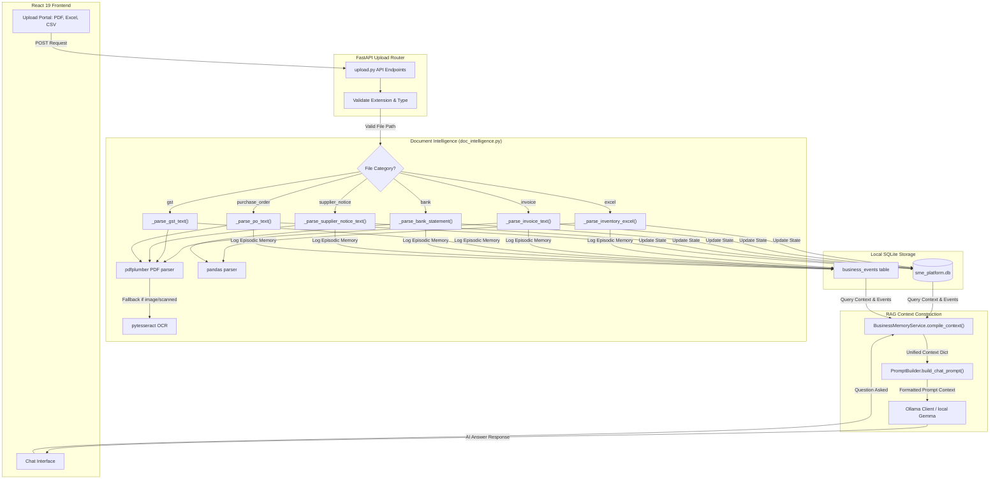

# Gemma SME OS: Document Ingestion & RAG Pipeline

This document provides a detailed breakdown of the Document Ingestion and Retrieval-Augmented Generation (RAG) architecture implemented in the Gemma SME OS (Stratify).

---

## 1. Architectural Philosophy: The "Zero-Cloud Leak" Memory Model

Unlike typical cloud-based RAG architectures that convert documents to vector embeddings and store them in a Vector Database (e.g., Chroma, Pinecone) using third-party APIs, Stratify uses a **local relational and episodic memory RAG model**.

### Why No Vector DB / Embeddings?
1. **Absolute Data Privacy**: Under the Zero-Cloud Leak model, no corporate financial ledger, tax filings, or customer invoices can be transmitted off-site.
2. **Determinism over Semantic Drift**: Financial reasoning requires exact figures, dates, and names. Vector semantic searches can suffer from retrieval inaccuracy (e.g., matching the wrong invoice or transaction).
3. **Structured Event Retrieval**: Documents are ingested, parsed into structured records, and stored as relational state updates combined with timestamped audit entries (`BusinessEvent` logs). These logs serve as the local LLM's "episodic memory."

---

## 2. Ingestion & RAG Data Flow

The diagram below details how uploaded files travel from the client to the database and ultimately into the LLM context:



---

## 3. Detailed Component Deep-Dive

### A. Document Routing & Validation
The entry points are defined in the [upload router](file:///Users/vaibhav/Documents/Projects/cashflow-ai/backend/app/routers/upload.py). Uploads are categorised into six distinct pipelines:
- **`invoice`** (PDF, PNG, JPG, JPEG)
- **`gst`** (PDF, JSON, XLSX)
- **`bank`** (PDF, CSV, XLSX, XLS)
- **`excel`** (XLS, XLSX)
- **`supplier_notice`** (PDF, PNG, JPG, JPEG)
- **`purchase_order`** (PDF, PNG, JPG, JPEG)

Uploaded files are stored in category-specific directories under the `./uploads` path, and processing is dispatched synchronously.

### B. Ingest parsing mechanisms
The [DocumentIntelligenceService](file:///Users/vaibhav/Documents/Projects/cashflow-ai/backend/app/services/doc_intelligence.py) processes the document depending on its category:
1. **Raw Text Extraction (`_get_document_text`)**:
   - First attempts text extraction using `pdfplumber`.
   - If no text is retrieved (i.e. scanned files or images), falls back to OCR using `pytesseract` to scan images.
   - If OCR fails, performs a raw string read.
2. **Deterministic Parsing**:
   - **Invoices**: Uses regular expressions and positional text lines to extract the partner name, invoice number, due date, total amount, and GST. Automatically identifies the type as `AR` (Accounts Receivable) or `AP` (Accounts Payable) based on context headers.
   - **Bank Statements**: Uses `pandas` to read CSV/XLSX structures, compiling transactions and auditing cash balances.
   - **Inventory Excel**: Reads standard tables to extract SKUs, product costs, sale prices, reorder levels, and stock levels.
   - **Supplier Price Notices**: Searches for keywords like `increase by` and the percentage increase.
   - **GST Returns**: Extracts net payable GST, input tax credits, and the filing period.
   - **Purchase Orders**: Parses order numbers, total amounts, and customer references.

---

## 4. State Synchronization & Reconciliation

Unlike standard semantic-search RAG, Stratify's pipeline triggers active operations to reconcile business data inside [doc_intelligence.py](file:///Users/vaibhav/Documents/Projects/cashflow-ai/backend/app/services/doc_intelligence.py):

| Category | Database Adjustments / Operations |
|---|---|
| **Inventory Excel** | Inserts or updates matching `Product` entries and synchronize quantities in the `Inventory` table. Automatically links products to suppliers. |
| **Invoices** | Upserts invoices into the `Invoice` ledger, calculating late payment flags and connecting them to corresponding `Supplier` or `Customer` entities. |
| **Bank Statements** | Sets the main `Company` cash balance to the statement's ending balance. Runs a reconciliation loop matching transactions against unpaid `AP` and `AR` invoices, updating them to `PAID` or `PARTIAL`. |
| **Supplier Notice** | Adjusts product costs by the parsed markup percentage for all products associated with that supplier. |
| **Purchase Order** | Registers a new wholesale `Sales` transaction in the database for the listed products. |

---

## 5. The Retrieval Phase (Augmenting Prompt Context)

Once files are ingested and relational records are updated, the retrieval phase compiles the information back into the LLM context.

### A. Context Aggregation (`BusinessMemoryService`)
When a chat message is posted to the [AI chat endpoint](file:///Users/vaibhav/Documents/Projects/cashflow-ai/backend/app/routers/ai.py), the [BusinessMemoryService](file:///Users/vaibhav/Documents/Projects/cashflow-ai/backend/app/services/business_memory.py) executes async SQLite queries:
- **Episodic Memory**: Queries the last 10 records from the `business_events` table (e.g. `DOC_INGESTED_INVOICE`, `DOC_INGESTED_BANK`).
- **Operational Snapshot**: Retrieves the company cash balance, top customers (by CLV), low stock items (quantities $\le$ reorder thresholds), and risky suppliers (lowest reliability score).
- **Feedback Loops**: Pulls the last 5 logs from `decision_history` to remind the LLM of past human overrides.

### B. Prompt Augmentation (`PromptBuilder`)
The [PromptBuilder](file:///Users/vaibhav/Documents/Projects/cashflow-ai/backend/app/utils/prompt_builder.py) acts as the context-injection template. It compiles this payload into formatted markdown text blocks:

```text
=== BUSINESS CONTEXT ===
Company: Stratify Electronics | Cash Balance: $411,500.00
...
=== RECENT EVENTS (last 10) ===
  [INFO] 2026-07-16 — DOC_INGESTED_INVOICE: Processed invoice_001.pdf (invoice_number: INV-2026-004, amount: 4500.0)
  [INFO] 2026-07-16 — DOC_INGESTED_BANK: Processed bank_statement.csv (ending_balance: 411500.0)
...
=== CRITICAL INVENTORY ALERTS ===
  ⚠ Mixer (SKU: SKU-MIX-01) — Stock: 2, Reorder Point: 10
...
=== OPERATOR QUESTION ===
[User Question Here]
```

This augmented context is sent to the local Ollama instance running the Gemma LLM, yielding contextually accurate and grounded answers without the need for high-latency external vector databases.
