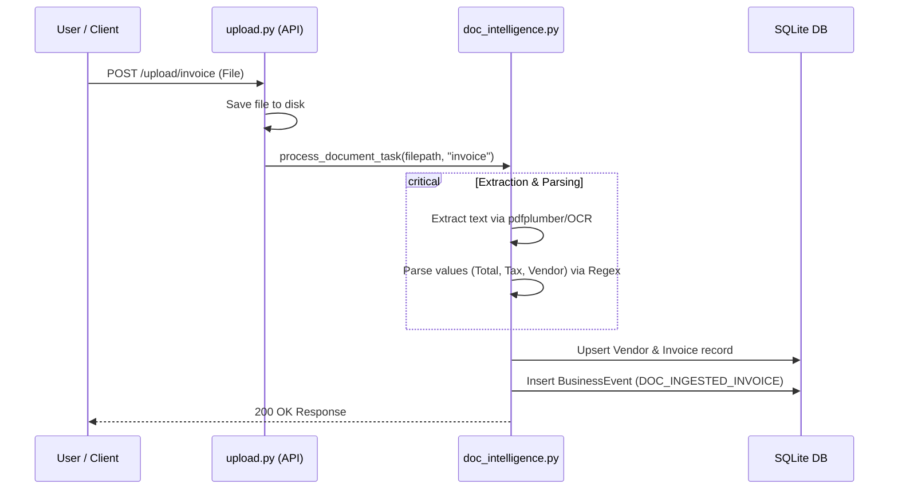
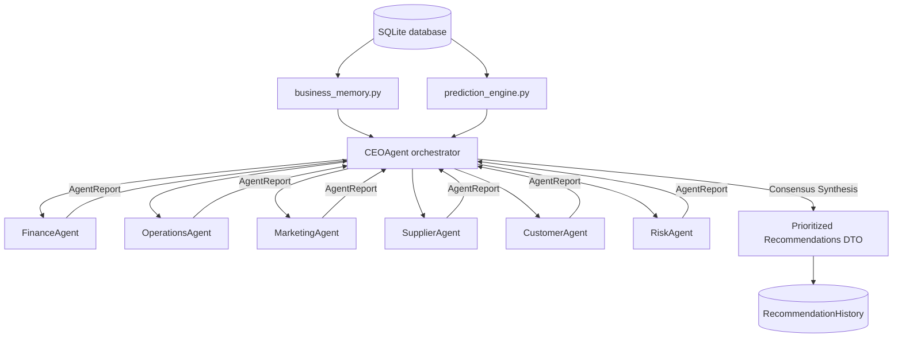

# Stratify (SME OS): Technical Specification & Workspace Directory

Stratify (SME OS) is an enterprise-grade, local-AI-driven Business Operating System built to automate decision-making, transactional ledger flows (CRUD), document ingestion parsing, and predictive runway analytics for Small & Medium Enterprises.

---

## 1. Project Goal & Core Architecture

The primary objective of Stratify (SME OS) is to solve the operations-intelligence gap for small-to-medium businesses. Traditional ERPs are complex and lack proactive decision intelligence. Stratify integrates everyday business actions (tracking sales, recording invoices, ordering inventory, and paying suppliers) with automated local AI diagnostics.

### The Solution Design
The application is structured around a decoupled architecture:
1. **Transactional Ledger Backend (FastAPI + SQLite)**: An async Python backend providing full relational endpoints for operations management.
2. **Predictive Analysis Layer (Stateless ML/Stats)**: Independent mathematical algorithms forecasting revenue, demand, and risk levels without polluting database states.
3. **Multi-Agent Decision Engine**: A deterministic specialist-orchestrator consensus model coordinating six business domains. It advises the CEO via prioritized, explainable action items.
4. **Digital Twin Scenario Modeler**: A predictive simulator enabling business owners to preview financial outcomes of pricing changes, hiring, and inventory investments before taking action.
5. **Interactive Workbench UI (Vite + React + CSS Variables)**: A premium, custom-styled dark dashboard with high visual contrast, real-time SVG charting, number animations, and context-aware chat.

---

## 2. Technology Stack & Frameworks

### Backend Technologies
*   **Language & Core**: Python 3.10+
*   **Web Framework**: [FastAPI](https://fastapi.tiangolo.com/) (ASGI framework with async route endpoints and lifespan handlers)
*   **Execution Server**: [Uvicorn](https://www.uvicorn.org/) (ASGI server)
*   **Database ORM**: [SQLAlchemy 2.0](https://www.sqlalchemy.org/) (Async engine with type mappings)
*   **Database Driver**: [aiosqlite](https://github.com/nbraha/aiosqlite) (Async driver for SQLite databases)
*   **Data Validation & DTOs**: [Pydantic V2](https://docs.pydantic.dev/) and `pydantic-settings` (Environment configuration and response/request serialization)
*   **Forecasting & Math**: [NumPy](https://numpy.org/) & [scikit-learn](https://scikit-learn.org/) (Weighted regressions, statistics, and moving averages)
*   **Data Import/Parsing**: [Pandas](https://pandas.pydata.org/) & [openpyxl](https://openpyxl.readthedocs.io/) (Excel workbook reading)
*   **Document Text & OCR**: [pdfplumber](https://github.com/jasonmc/pdfplumber), [pypdf](https://github.com/py-pdf/pypdf), [pytesseract](https://github.com/madmaze/pytesseract) (Optical Character Recognition), and [Pillow](https://python-pillow.org/) (Image processing)
*   **API Client**: [httpx](https://www.python-httpx.org/) (Async HTTP client to talk to the local Ollama daemon)

### AI Core
*   **LLM Platform**: Local [Ollama](https://ollama.com/) daemon integration
*   **Configured Models**: `gemma4:latest` (main model), `gemma4:e4b` (fallback model)

### Frontend Technologies
*   **Core**: React 19 (Single Page Application SPA)
*   **Build & Dev Server**: [Vite 8](https://vite.dev/)
*   **Language**: [TypeScript](https://www.typescriptlang.org/)
*   **Styling**: Vanilla CSS utilizing modern variables, CSS nesting, and OKLCH color spaces. No bloated CSS frameworks are used.
*   **Icons**: [Lucide React](https://lucide.dev/)
*   **Network Client**: [Axios](https://axios-http.com/)
*   **Alerts**: [React Hot Toast](https://react-hot-toast.com/)

---

## 3. Workspace Structure & File-by-File Directory

Below is the absolute file-by-file configuration directory mapping every path, purpose, and key imports/exports.

### Root Directory
*   [README.md](file:///d:/IT/stratify/README.md) — Complete architectural & operational specification of the project.
*   [design.md](file:///d:/IT/stratify/design.md) — The locked design system specifying the color palette, OKLCH values, typography standards, spacing tokens, animations, hover stances, and CTA standards.
*   [.gitignore](file:///d:/IT/stratify/.gitignore) — Tells Git which local files to ignore (virtual environments, database `.db` files, compiled assets, node modules, and uploaded storage folders).
*   [package-lock.json](file:///d:/IT/stratify/package-lock.json) — System-generated lock file for root npm packages.
*   [skills-lock.json](file:///d:/IT/stratify/skills-lock.json) — Local agent integrations tracker.

### Documentation Directory
*   [0001-multi-agent-decision-engine.md](file:///d:/IT/stratify/docs/decisions/0001-multi-agent-decision-engine.md) — Architectural Decision Record (ADR) documenting the Specialist-Orchestrator multi-agent consensus pattern, design decisions, and evaluated alternatives.

### Backend: FastAPI ASGI App
The main Python package is located under `backend/app/`.

#### Core Config & Entrypoints
*   [requirements.txt](file:///d:/IT/stratify/backend/requirements.txt) — Production and development Python package dependencies.
*   [docker-compose.yml](file:///d:/IT/stratify/backend/docker-compose.yml) — Container configuration mapping FastAPI app with a local containerized Ollama engine.
*   [main.py](file:///d:/IT/stratify/backend/app/main.py) — Application bootstrapper. Configures async lifespan startup/shutdown hooks (table initialization and pool closures), CORS, and registers API routers under version prefix `/api/v1`.
*   [config.py](file:///d:/IT/stratify/backend/app/config.py) — Configures settings loaded from local `.env` files via Pydantic settings. Defines default paths, database variables, model names, temperature levels, and upload directory settings.
*   [database.py](file:///d:/IT/stratify/backend/app/database.py) — Database bootstrapping code. Sets up the async SQLAlchemy engine using `sqlite+aiosqlite`, instantiates the session maker `AsyncSessionLocal`, declares the ORM metadata class `Base`, and exports the dependency `get_db`.

#### Database ORM Entity Models
*   [business.py](file:///d:/IT/stratify/backend/app/models/business.py) — Declarative ORM models representing business ledger entities:
    *   `Company`: One-row master profile, including annual goals and operating cash balance.
    *   `Customer`: Buyers directory tracking credit score, limits, activity flags, and CLV.
    *   `Supplier`: Vendors directory tracking lead times and delivery reliability scores.
    *   `Product`: SKU catalogue tracking prices, purchase costs, inventory level, and reorder margins.
    *   `Invoice`: Ledger accounts receivable (AR) and accounts payable (AP) mappings.
    *   `Sales`: Transaction log connecting product sales volume and customer profiles.
    *   `Inventory`: Real-time stock counts.
    *   `Employee`: Payroll and department roster.
*   [history.py](file:///d:/IT/stratify/backend/app/models/history.py) — Auditing tables and memory records:
    *   `BusinessEvent`: Timeline events logging sales, supplier delays, and file uploads with severities (`INFO` | `WARNING` | `CRITICAL`).
    *   `RecommendationHistory`: Stored AI recommendations generated by specialist agents.
    *   `DecisionHistory`: Tracks user actions (`APPROVED` | `REJECTED`) and observed outcome statistics for recommendation cards.

#### Data Validation Schemas (Pydantic V2)
*   [business.py](file:///d:/IT/stratify/backend/app/schemas/business.py) — Schemas verifying payload constraints (`Base`, `Create`, `Update`, `Schema`) for business models, plus `ChatRequest` / `ChatResponse` schemas.
*   [predictive.py](file:///d:/IT/stratify/backend/app/schemas/predictive.py) — Structs for analytical queries: generic predictions, custom product sales outputs, customer churn probabilities, supplier delay risk labels, and margin pricing optimization targets.
*   [decision.py](file:///d:/IT/stratify/backend/app/schemas/decision.py) — Validation shapes for multi-agent output, explainability data, digital twin parameters (`SimulationInput`), and twin projection outputs (`SimulationOutput`).

#### API Version 1 Routers
*   [business.py](file:///d:/IT/stratify/backend/app/routers/business.py) — Standard CRUD routes for CRUD business database entities.
*   [dashboard.py](file:///d:/IT/stratify/backend/app/routers/dashboard.py) — Exposes high-level dashboard metrics (monthly margins, cash ratio, low-stock counts), active alert triggers, and event log timelines.
*   [ai.py](file:///d:/IT/stratify/backend/app/routers/ai.py) — Handles the context-aware chatbot pipeline and morning executive summary endpoints.
*   [forecast.py](file:///d:/IT/stratify/backend/app/routers/forecast.py) — Exposes endpoints mapping statistical forecasts for revenue, cash flow runway, and stock demand.
*   [risk.py](file:///d:/IT/stratify/backend/app/routers/risk.py) — Maps routes assessing customer churn probabilities, supplier delivery risks, and pricing margin advice.
*   [decision.py](file:///d:/IT/stratify/backend/app/routers/decision.py) — Drives agent run summaries, CEO synthesis payloads, digital twin what-if calculations, decision feedback triggers, and explainability audits.
*   [upload.py](file:///d:/IT/stratify/backend/app/routers/upload.py) — Direct target routes for document uploads (PDFs, images, Excel worksheets) which queue parsing tasks.

#### Core Logic & Processing Services
*   [agent_engine.py](file:///d:/IT/stratify/backend/app/services/agent_engine.py) — Orchestrator-Specialist Engine. Evaluates rule heuristics across domains:
    *   `FinanceAgent`: Audits gross margin metrics and AR vs AP balances.
    *   `OperationsAgent`: Assesses SKU stockout risk and vendor performance delays.
    *   `MarketingAgent`: Triggers loyalty plans for VIPs and retention campaigns for high-churn accounts.
    *   `SupplierAgent`: Identifies vendor concentration hazards.
    *   `CustomerAgent`: Warns about late payment behaviors and credit scores.
    *   `RiskAgent`: Aggregates active warning vectors to calculate a composite enterprise risk level.
    *   `CEOAgent`: Orchestrates context mapping, triggers specialists, computes consensus metrics, and prioritizes actions.
*   [business_memory.py](file:///d:/IT/stratify/backend/app/services/business_memory.py) — Context assembler compiling company states, alerts, recent events, and past decision logs into static data arrays.
*   [doc_intelligence.py](file:///d:/IT/stratify/backend/app/services/doc_intelligence.py) — The parser pipeline. Implements algorithms reading Excel inventories via pandas, extracting invoice headers via OCR/regex parsing, mapping bank statement CSV/XLS balances, and committing the matching changes back to SQLite database objects.
*   [ollama_client.py](file:///d:/IT/stratify/backend/app/services/ollama_client.py) — Communicates with local Ollama daemons, handling system context construction, timeouts, model polling, and automated fallback when the primary model fails.
*   [prediction_engine.py](file:///d:/IT/stratify/backend/app/services/prediction_engine.py) — Stateless forecasting layer. Includes exponentially weighted moving averages for revenue, cash balance forecasting, customer churn regressions, supplier reliability trends, and product margin targets.
*   [simulation_engine.py](file:///d:/IT/stratify/backend/app/services/simulation_engine.py) — Digital twin scenarios processor. Calculates projected revenues, margins, and risk scores from hypothetical price changes, new hires, marketing, or loans, without modifying SQLite records.

#### Utilities
*   [helpers.py](file:///d:/IT/stratify/backend/app/utils/helpers.py) — Shared utility functions: number clamping, safe division, and math checks.
*   [prompt_builder.py](file:///d:/IT/stratify/backend/app/utils/prompt_builder.py) — Compiles business memory context details into optimized text prompts for chat queries and executive summaries.

---

### Frontend: React Single Page App
The UI package is located under `frontend/`.

#### Core Config & Mounts
*   [package.json](file:///d:/IT/stratify/frontend/package.json) — Frontend package dependencies and scripts (Vite, TypeScript, oxlint).
*   [tsconfig.json](file:///d:/IT/stratify/frontend/tsconfig.json) — TypeScript compiler rules.
*   [vite.config.ts](file:///d:/IT/stratify/frontend/vite.config.ts) — Bundler rules, asset compilation paths, and development server proxy routing.
*   [index.html](file:///d:/IT/stratify/frontend/index.html) — DOM root element where Vite loads the client.
*   [main.tsx](file:///d:/IT/stratify/frontend/src/main.tsx) — Renders the main React element to the DOM.

#### React Code & Interface Components
*   [App.tsx](file:///d:/IT/stratify/frontend/src/App.tsx) — Core interface controller containing the layout states, sidebar navigation tabs, bento grid rendering components, SVG charts, and interactive page views:
    *   `DashboardView`: Visualizes live KPIs, health score dial, alert notices, and chronological timelines.
    *   `ForecastView`: Projects revenue trends, cash runway boundaries, and product demand metrics.
    *   `RiskView`: Details supplier and customer risk profiles in tabular formats.
    *   `AgentsView`: Lists domain-specific reports and strategic suggestions.
    *   `SimulateView`: Renders range sliders to run digital twin scenarios.
    *   `ChatView`: Provides an interactive terminal window to chat with the local LLM.
    *   `BriefView`: Renders the morning brief summary and prioritized checklist.
    *   `HistoryView`: Logs user approval actions for historical analysis.
    *   `UploadView`: Provides a file drag-and-drop box to upload invoices and statements.
*   [api.ts](file:///d:/IT/stratify/frontend/src/api.ts) — Axios connection mapping endpoints to local React state callbacks.
*   [index.css](file:///d:/IT/stratify/frontend/src/index.css) — Custom styles: OKLCH variables, CSS grid layouts, bento alignments, custom scrollbars, and card micro-animations.
*   [App.css](file:///d:/IT/stratify/frontend/src/App.css) — Workbench grid properties.

---

### Customized Agent Customizations
*   [SKILL.md](file:///d:/IT/stratify/.agents/skills/sme_os_verifier/SKILL.md) — Auditing guidelines for the verifier skill.
*   [verify_stack.sh](file:///d:/IT/stratify/.agents/skills/sme_os_verifier/scripts/verify_stack.sh) — Audits file existence, imports, and processes running on local ports.

---

## 4. Key Feature Implementations & Logic Flow

### A. Document Intelligence (Doc Ingestion Pipeline)
When a document is uploaded via `POST /api/v1/upload/{category}`:
1.  **Storage**: The file is stored inside `backend/uploads/{category}`.
2.  **Dispatch**: [upload.py](file:///d:/IT/stratify/backend/app/routers/upload.py) calls `process_document_task` in the [doc_intelligence.py](file:///d:/IT/stratify/backend/app/services/doc_intelligence.py) layer.
3.  **Parsing**:
    *   **Excel**: Reads the sheets via Pandas to parse product tables (selling price, cost, stock, and reorder levels) and upserts them into the database.
    *   **PDF/Image Invoices**: Uses `pdfplumber` for text extraction (falling back to Tesseract OCR if needed). Regex extractors map invoice numbers, totals, due dates, and supplier details to create a new `Invoice` object.
    *   **Bank Statements**: Extracts ending balances and reconciles cash flows by automatically matching debits/credits against pending invoices.
4.  **Event Logger**: Creates a `BusinessEvent` record (e.g. `DOC_INGESTED_INVOICE`), which populates the dashboard timeline.



---

### B. Predictive Runway Engine
Stateless forecasting is handled within [prediction_engine.py](file:///d:/IT/stratify/backend/app/services/prediction_engine.py):
1.  **Revenue Forecast**: Employs an exponential moving average (EMA) weighted over the past 90 days. Recent sales have a higher weight. If data points are sparse ($N < 3$), a safe baseline is returned with a lower confidence rating.
2.  **Cash Flow Runway**: Computes outstanding accounts receivable (AR) against outstanding accounts payable (AP) over a 30-day window, outputting a composite liquidity ratio.
3.  **Demand Forecasting**: Uses historical unit velocity per product to estimate 30-day unit demand, outputting stockout warnings and reorder recommendations.
4.  **Customer Payment Risk**: Models credit scores and lifetime values to classify accounts into risk tiers (`LOW` | `MEDIUM` | `HIGH`) for late payment probability.
5.  **Pricing Recommendations**: Checks current product gross margin percentages. If margins fall below 35%, it suggests an optimized price increase and calculates the projected profit uplift.

---

### C. Specialist-Orchestrator Multi-Agent Engine
The core intelligence layer follows a Specialist-Orchestrator pattern defined in [agent_engine.py](file:///d:/IT/stratify/backend/app/services/agent_engine.py):
1.  **Domain Specialists**: Six agents (`FinanceAgent`, `OperationsAgent`, `MarketingAgent`, `SupplierAgent`, `CustomerAgent`, and `RiskAgent`) are executed in an async pipeline.
2.  **Standardized Reporting**: Each agent reviews the business memory context and outputs a standard dictionary format:
    ```python
    {
        "agent_name": str,
        "analysis": str,
        "recommendations": list[str],
        "confidence": float,
        "risk_level": str,
        "supporting_evidence": list[str]
    }
    ```
3.  **CEO Synthesis**: The `CEOAgent` collects individual reports and runs the consensus algorithm. Recommendations are prioritized based on:
    $$\text{Prioritization Score} = \text{Confidence} \times \text{Risk Weight}$$
    *Risk weights are defined as: `CRITICAL` (0.3), `HIGH` (0.5), `MEDIUM` (0.7), and `LOW` (1.0). Lower weights represent more severe risks, prioritizing them at the top of the queue.*
4.  **Audited Action Plan**: High-priority recommendations are logged to `RecommendationHistory` and returned to the client as an actionable corporate directive.



---

### D. Digital Twin Scenario Modeler
The twin engine runs in [simulation_engine.py](file:///d:/IT/stratify/backend/app/services/simulation_engine.py) to calculate what-if projections:
*   **Mathematical Multipliers**:
    *   *Price Elasticity*: Uses a target elasticity coefficient of $-0.5$. A price increase reduces projected sales volume proportionally:
        $$\Delta \text{Revenue} = \text{Revenue}_{\text{base}} \times 0.1 \times (\text{PriceDelta} + (-0.5 \times \text{PriceDelta}))$$
    *   *Headcount Return*: Each new hire adds salary expenses but yields a $+5\%$ productivity gain on projected revenues.
    *   *Procurement Savings*: Consolidating suppliers to single-sourcing assumes an $8\%$ cost saving from volume discounts, but flags a high supply chain risk. Diversification models a $5\%$ cost saving and lower risk.
    *   *Inventory & Marketing ROI*: Inventory investments assume a $1.3\times$ return multiplier, while marketing models a $3\times$ yearly return on monthly spend.
    *   *Loans*: Integrates loan principal and interest rates into projected cash levels while adjusting overall leverage risk.
*   **Output**: Projections are returned as a `SimulationOutput` containing a calculated corporate health score (ranging from $0$ to $100$) and warnings, without modifying live database states.

---

### E. Premium UI Dashboard Layout & Design system
The frontend provides a dark dashboard experience based on design rules from [design.md](file:///d:/IT/stratify/design.md):
*   **Colors & Themes**: Implements an austerity monochrome style using deep charcoal and midnight tones (`oklch(10% 0.002 250)`) contrasted with off-white text and borders.
*   **Glassmorphism**: Panels are rendered with `.glass-panel` wrappers using transparent overlay colors, a `12px` backdrop filter blur, and subtle border lines (`rgba(255,255,255,0.08)`).
*   **Inline SVG Telemetry**: Trends are rendered dynamically using raw inline SVGs for sparklines and regression plots. The telemetry charts calculate shaded polygons representing upper and lower confidence boundaries.
*   **Accessibility**: Custom tickers count up to numbers with transition effects. The layout respects the standard accessibility query media rule `prefers-reduced-motion`.

---

## 5. Operations & Execution Manual

### Local Stack Launch

#### Backend Launch
1.  Navigate to the backend folder:
    ```powershell
    cd backend
    ```
2.  Set up the isolated virtual environment:
    ```powershell
    python -m venv venv
    ```
3.  Activate the environment:
    *   PowerShell: `.\venv\Scripts\Activate.ps1`
    *   Command Prompt: `.\venv\Scripts\activate.bat`
    *   Bash/WSL: `source venv/bin/activate`
4.  Upgrade pip and install requirements:
    ```powershell
    python -m pip install --upgrade pip
    python -m pip install -r requirements.txt
    ```
5.  Start the FastAPI backend server:
    ```powershell
    python -m uvicorn app.main:app --reload --port 8000
    ```

#### Frontend Launch
1.  Navigate to the frontend folder:
    ```powershell
    cd frontend
    ```
2.  Install npm dependencies:
    ```powershell
    npm install
    ```
3.  Launch Vite development server:
    ```powershell
    npm run dev
    ```
    *The UI launches at `http://localhost:5173/`, proxying `/api/v1` routes to `http://localhost:8000/api/v1`.*

---

### Automated Audits & Verification
To verify code compilation, database schemas, and service ports, execute the verification script:
```bash
./.agents/skills/sme_os_verifier/scripts/verify_stack.sh
```
This script audits:
1.  If `backend/sme_platform.db` exists.
2.  If the FastAPI application compiles and imports correctly without schema errors.
3.  If the server is active on port 8000 and the health check endpoint returns `200`.
4.  If the frontend build runs.
